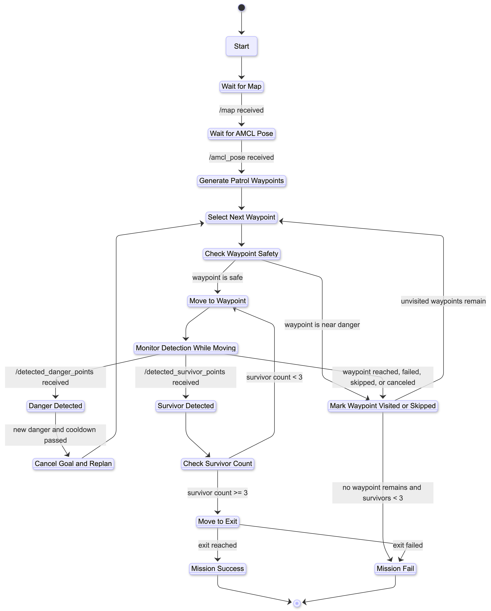

# Track‑Be

<div align="center">


# 🔥 Track‑Be

### Intelligent Wildfire Rescue Robot

> "Not the shortest path. The safest path."

## Autonomous Wildfire Rescue & Safe Path Navigation System

Track‑Be는 실내 화재 상황에서 사람을 탐색하고,
실시간으로 위험 지역을 분석하여,
위험 지역을 회피하며,
가장 안전한 탈출 경로를 안내하는
자율주행 구조 로봇 프로젝트입니다.


</div>

---

## 프로젝트 소개

Track-Be는 실내 화재와 같은 재난 상황에서 사람을 안전한 경로로 유도하기 위한 자율주행 구조 로봇 프로젝트입니다.

로봇은 SLAM 기반으로 주변 환경을 인식하고, 위험 지역(불길, 장애물 등)을 회피하며 사람에게 접근한 뒤 가장 안전한 탈출 경로를 계산하여 안내합니다.

본 프로젝트는 ROS2 Jazzy와 Gazebo Sim 환경에서 TurtleBot3를 활용하여 개발되며, 실제 재난 환경에서 활용 가능한 안전 경로 탐색 알고리즘과 로봇 자율주행 기술 구현을 목표로 합니다.

---

# Why Track‑Be?

실내 화재와 같은 재난 상황에서는 연기와 화재로 인해 시야 확보가 어려워지고,
사람들은 빠르게 안전한 탈출 경로를 판단하기 어렵습니다.

특히 산악 지형은:

* 구조 인력 접근 제한
* 실시간 상황 변화
* 화재 확산 속도 증가
* GPS 오차 및 시야 제한

등의 문제를 가지고 있습니다.

Track‑Be는 이러한 환경에서:

```text
Detect → Analyze → Navigate → Rescue
```

의 흐름을 기반으로,
로봇이 직접 위험 지역을 분석하고 안전 경로를 계산하여 사람을 탈출구까지 유도하는 시스템을 목표로 합니다.

---

# 프로젝트 배경

실내 화재와 같은 재난 상황에서는 연기와 화재로 인해 시야 확보가 어려워지고, 일반 사람들은 안전한 탈출 경로를 빠르게 판단하기 어렵습니다.

특히 다양한 장애물과 벽이 있는 지형에서는 구조 인력의 접근이 제한되며, 위험 지역을 실시간으로 탐색하고 사람을 안전한 경로로 유도할 수 있는 자율주행 시스템의 필요성이 증가하고 있습니다.

Track-Be는 이러한 문제를 해결하기 위해 다음과 같은 기능을 목표로 합니다.

* 위험 지역 탐색
* 사람 위치 탐지
* 안전 경로 계산
* 실시간 경로 재탐색
* 자율주행 기반 탈출 유도

---

# ✨ Core Features

| Feature               | Description          |
| --------------------- | -------------------- |
| Autonomous Navigation | 자율주행 기반 경로 이동        |
| Safe Path Planning    | 위험 지역 회피 기반 안전 경로 탐색 |
| Real-time Mapping     | SLAM 기반 실시간 지도 생성    |
| Rescue Guidance       | 사람 위치 탐색 및 탈출 유도     |
| Dynamic Replanning    | 화재 확산 시 경로 재탐색       |

---

# 🧭 State Diagram

<div align="center">
  
</div>

---


# 🛠️ Tech Stack

<div align="center">

| Category       | Stack                       |
| -------------- | --------------------------- |
| Robot Platform | TurtleBot3 Burger           |
| Middleware     | ROS2 Jazzy                  |
| Simulation     | Gazebo Sim                  |
| Visualization  | RViz2                       |
| Navigation     | Nav2                        |
| SLAM           | SLAM Toolbox / Cartographer |
| Language       | Python                      |
| Path Planning  | A* Algorithm                |
| OS             | Ubuntu 24.04                |
| Collaboration  | GitHub                      |

</div>

---


# Expected Impact

## Smart Disaster Response

Track‑Be는 재난 상황에서 사람 대신 위험 지역을 탐색하며,
안전한 탈출 경로를 실시간으로 제공할 수 있습니다.

## Autonomous Rescue Robotics

SLAM, Navigation, Path Planning 기술을 실제 구조 시나리오에 적용하여
재난 대응 로봇 시스템의 가능성을 제시합니다.

## Real-time Safe Navigation

단순 최단 경로가 아닌,
위험도 기반 안전 경로 탐색을 통해
보다 현실적인 재난 대응이 가능합니다.

## Future Expansion

향후에는:

* YOLO 기반 사람 탐지
* 열화상 센서
* 화재 확산 예측
* 다중 로봇 협업
* 드론 연동

등으로 확장 가능합니다.

---

# 🚀 Expected Impact

## 1. 재난 대응 효율 향상

재난 상황에서 사람들에게 빠르고 안전한 탈출 경로를 제공하여 구조 효율을 향상시킬 수 있습니다.

## 2. 위험 지역 탐색 자동화

사람이 직접 접근하기 어려운 위험 지역을 로봇이 대신 탐색할 수 있습니다.

## 3. 실시간 안전 경로 제공

화재 확산 및 장애물 변화에 따라 실시간으로 경로를 재계산하여 안전성을 높일 수 있습니다.

## 4. 자율주행 로봇 기술 응용

SLAM, Navigation, Path Planning 등의 로봇 기술을 실제 재난 구조 분야에 적용할 수 있습니다.

---

# 👥 Team Members

| 이름  | 역할                              |
| --- | ------------------------------- |
| 서혜인 | 안전 경로 탐색 알고리즘, A* Path Planning |
| 정범우 | Gazebo 환경 및 맵 제작                |
| 서은비 | TurtleBot3 Navigation 및 ROS2 통합 |
| 박다영 | 객체 탐지 및 위험 지역 처리                |

---

# 🎯 Project Goals

* 실내 환경 기반 Gazebo 시뮬레이션 구축
* 위험 지역 회피 알고리즘 구현
* TurtleBot3 자율주행 구현
* 안전 경로 탐색 시스템 구현
* 재난 구조 시나리오 시뮬레이션


---


# 🌌 Vision

Track‑Be는 단순한 로봇 시뮬레이션 프로젝트를 넘어, 실제 재난 구조 상황에서 활용 가능한 안전 경로 유도 시스템을 목표로 합니다.

향후에는 화재 탐지, 객체 인식, 다중 로봇 협업, 실시간 센서 데이터 처리 등을 추가하여 보다 지능적인 재난 대응 로봇 플랫폼으로 확장할 계획입니다.

# 📄 Project Documents

[](docs/TrackBe_Proposal.pdf)
